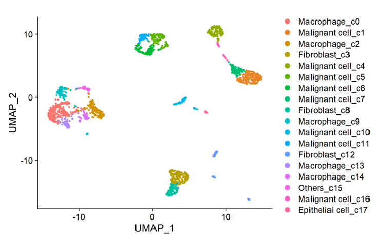
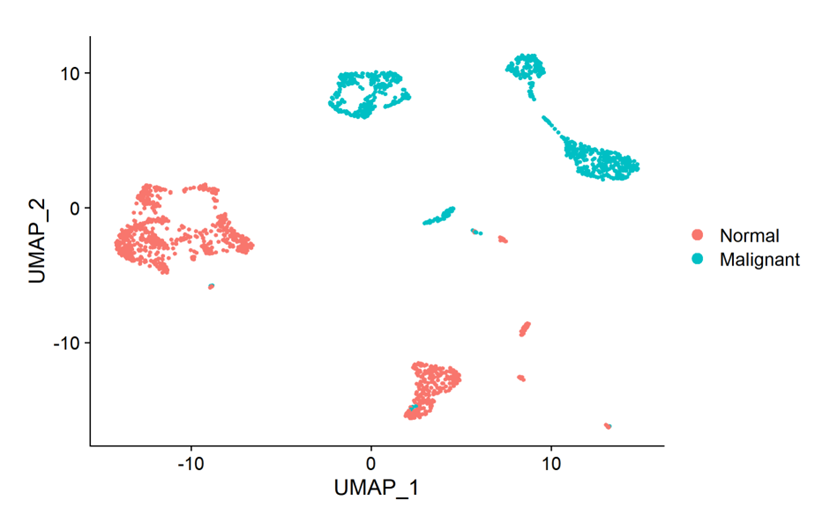
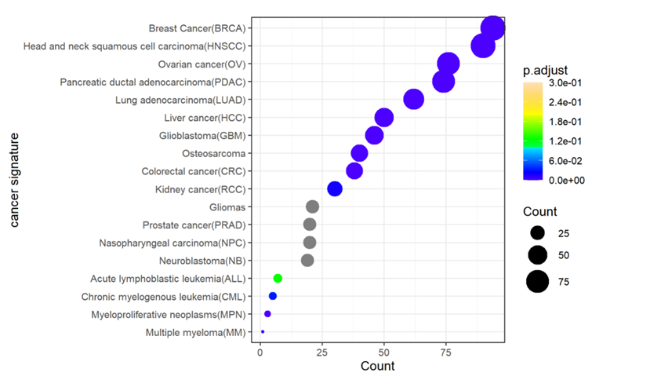
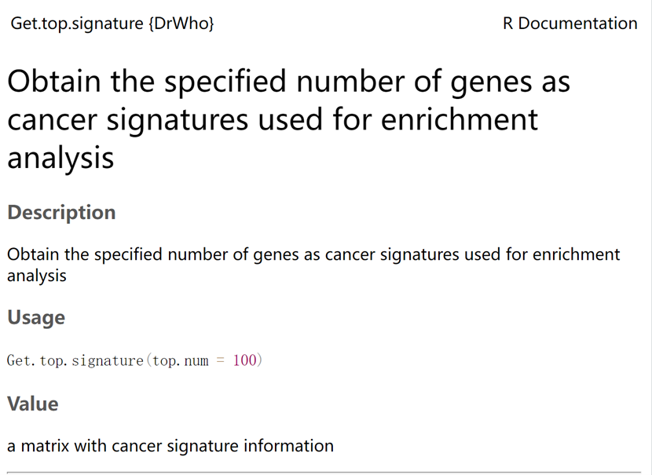
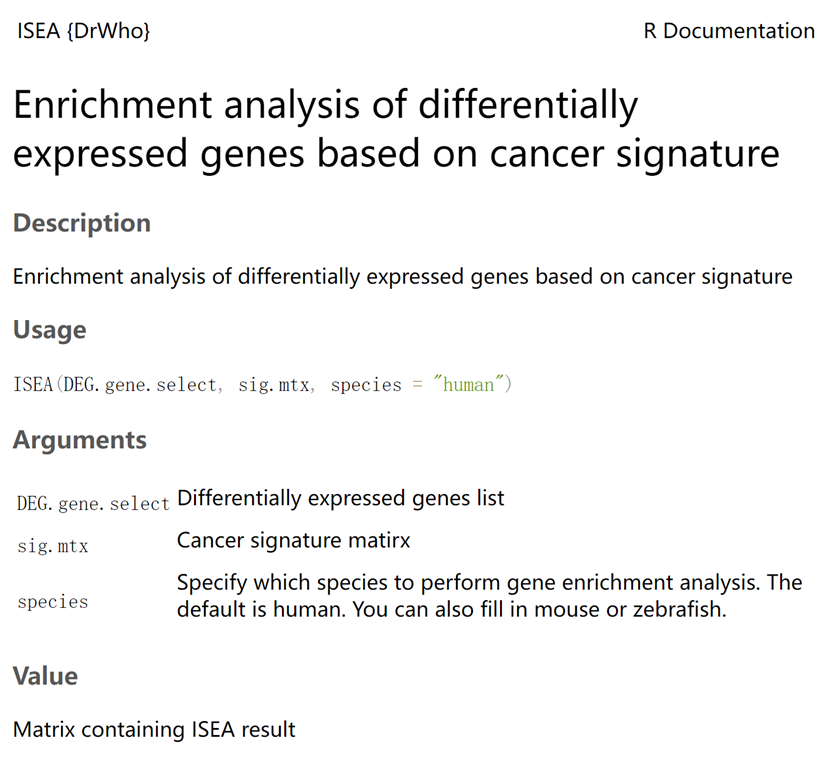

### DrWho: Disease-rating genome-wide search engine for human single-cell omics. 

#### 1. Description

`DrWho` is a method for enrichment analysis between differentially expressed genes from different types of tumours and cancer signatures, which is built on top of Seurat and homologene.

#### 2. Installation

Install the development version from GitHub.

```R
devtools::install_github("https://github.com/dys1997/DrWho.git")
```

#### 3. Usage

```R
library(Seurat)
library(DrWho)
data  = readRDS("H:/SCAR_ZONG/Cancer/SCAR_Atlas_0686.rds")
DimPlot(data)
```



```R
data$Group <- ifelse(grepl("Malignant", data$cell_type), "Malignant", "Normal")
Idents(data) = data$Group
DimPlot(data)
```



##### Identification of Differentially Expressed Genes

```r
DEG = FindMarkers(data,ident.1 = "Malignant",ident.2 = "Normal")
DEG.used = DEG[DEG$avg_log2FC >2,]
DEG.used = DEG.used[DEG$p_val < 0.01,]
complete_rows <- complete.cases(DEG.used)
DEG.used <- DEG.used[complete_rows, ]
DEG.gene.select = rownames(DEG.used)
cancer.sig = Get.top.signature(top.num = 200)
res = ISEA(DEG.gene.select = DEG.gene.select,sig.mtx = cancer.sig)
DrWho::ISEA.Plot(res)
```



#### 4. Function Documentation





#### 5. Citation

Hao and Hao et al. Integrated analysis of multimodal single-cell data. Cell (2021) [Seurat V4]

https://cran.r-project.org/web/packages/homologene/index.html（Ogan Mancarci [aut, cre], Leon French [ctb]）

#### 6. Contact Information

If you have any questions, feel free to [contact us](https://github.com/dys1997/DrWho?tab=readme-ov-file).
